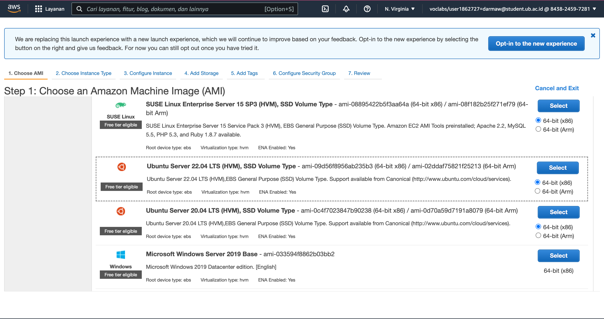
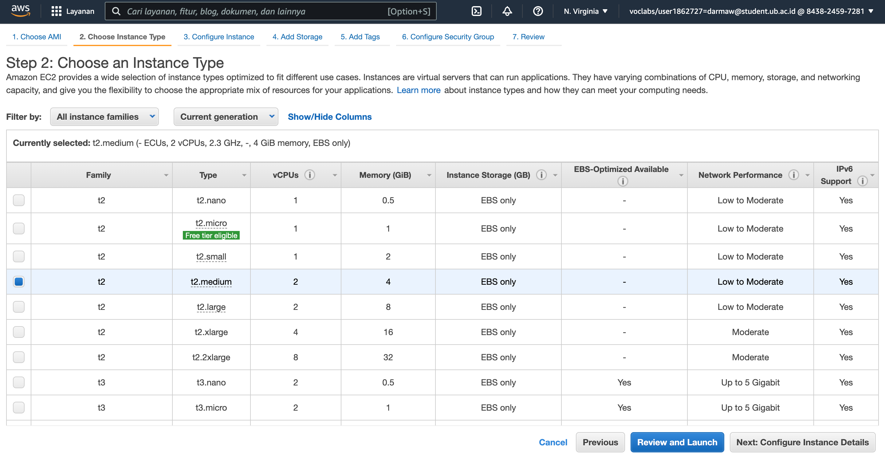
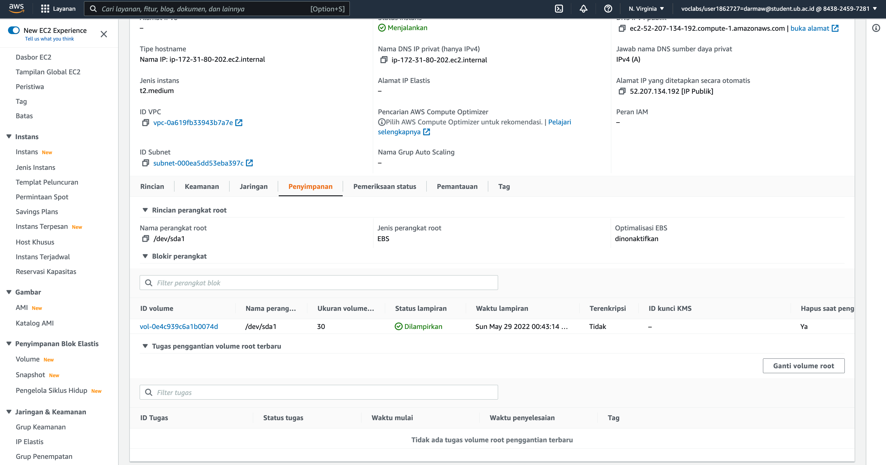
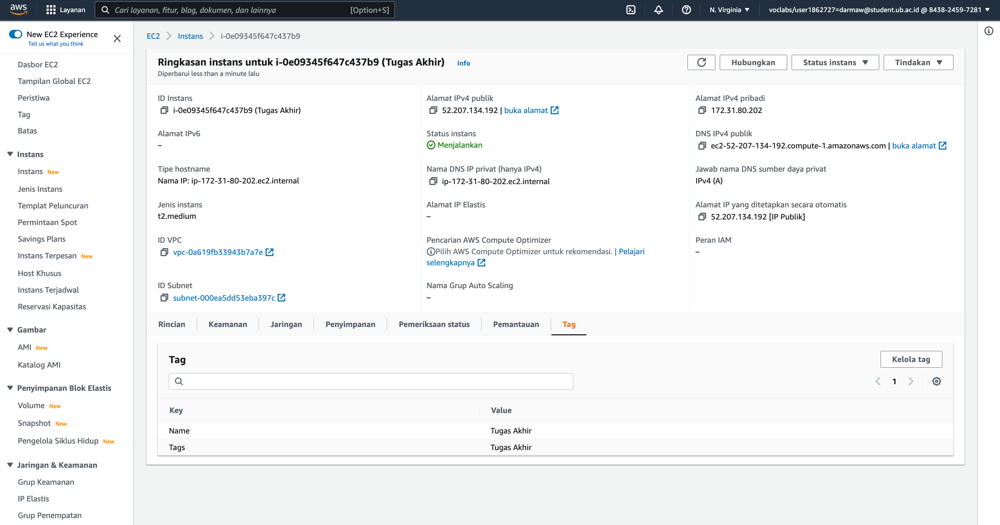
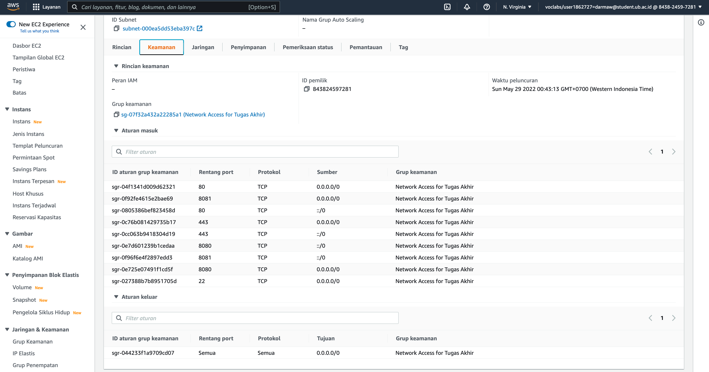
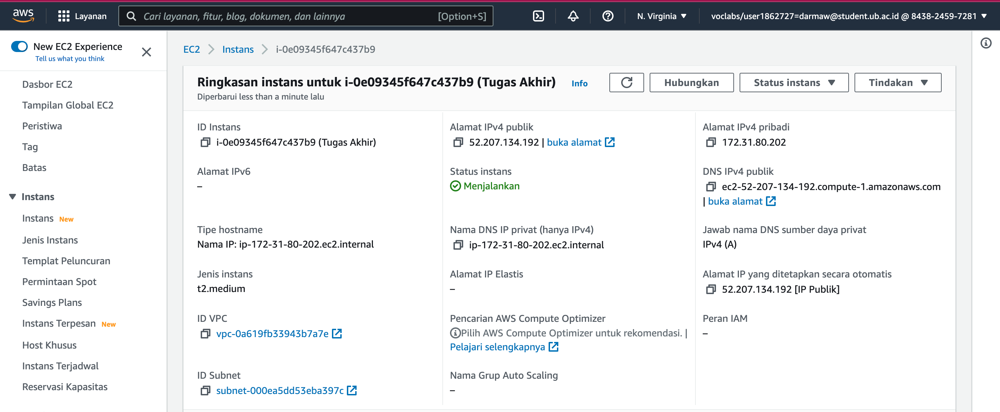
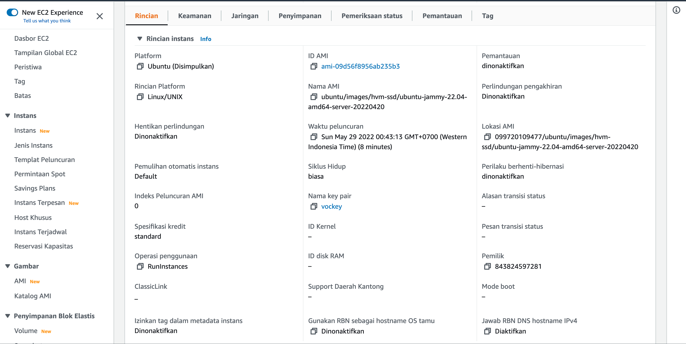

Tugas 1

Instalasi AWS EC2

1. Buat Instance pada halaman EC2
2. Pilih OS yang akan di install (Ubuntu Server 20.04 LTS).

3. Kemudian pilih tipe instance yang diinginkan. Pada hal ini memuat CPU, memori, penyimpanan, dan kapasitansi jaringan, dan memungkinkan user untuk memilih campuran sumber daya yang sesuai untuk aplikasi (t2.medium).

4. Selanjutnya pada konfigurasi detail instance, dalam praktek ini tidak perlu diubah isiannya dan langsung klik next page untuk mengatur storage server.

5. Pada storage isi size 30 GiB dengan tipe volume gp3. Ketika instance terbuat akan ditampilkan storage yang sudah diatur.

6. Kemudian pada halaman selanjutnya tambahkan tags (Name and tags: Tugas Akhir) yang nantinya akan menampilkan pada kolom tags seperti berikut.

7. Selanjutnya akan mengkonfigurasi security group pada instance dengan ketentuan (Edit Network settings: allow SSH, allow HTTP, allow HTTPS, allow TCP port 8080, allow TCP port 8081)

8. Terakhir pada halaman Review and Launch, pilih tombol Launch.
9. Instance telah berhasil dibuat.

