Tugas 2

- Topology Mininet 2 Host dan 2 Switch

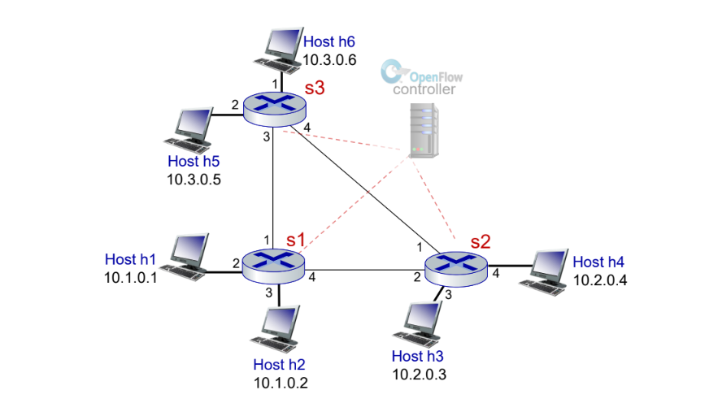

1. Jalankan mininet tanpa controller menggunakan custom topo yang sudah dibuat.

```
sudo mn --controller=none --custom custom_topo_2sw2h.py --topo mytopo --mac --arp
```
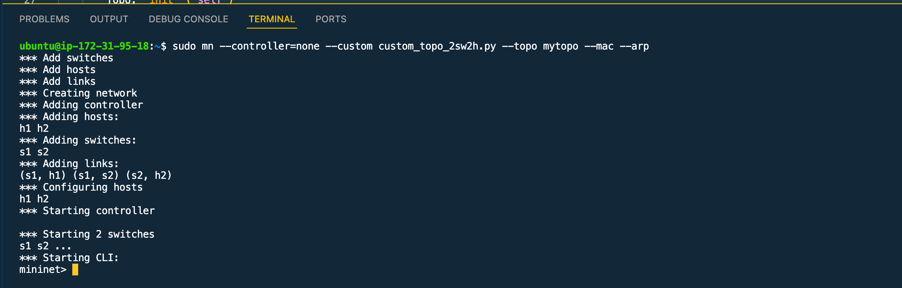

2. Buat flow agar h1 dapat terhubung dengan h2. Uji koneksi agar h1 dengan h2.

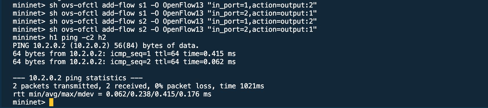

-  Topology Mininet 3 Switch (loop) dengan 6 Host dengan Penerapan STP (spanning tree protocol)

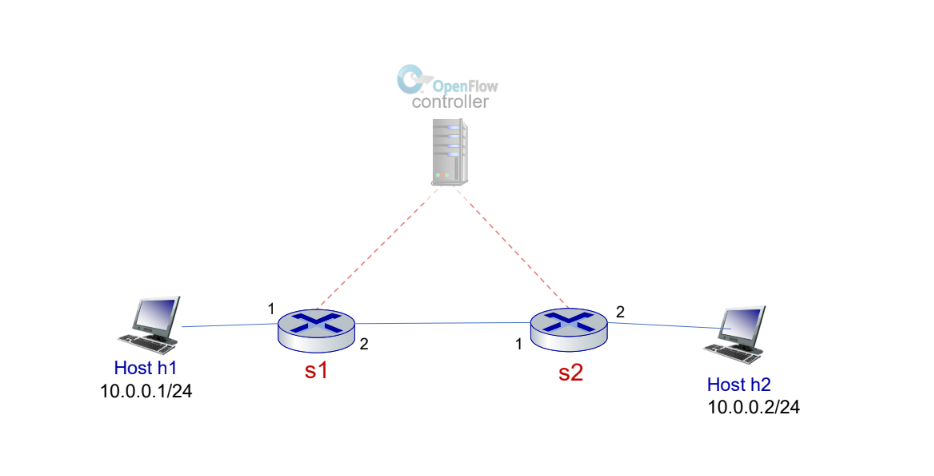

1. Jalankan program Ryu STP yang berada pada folder ryu.

```
ryu-manager ryu/ryu/app/simple_switch_stp_13.py
```
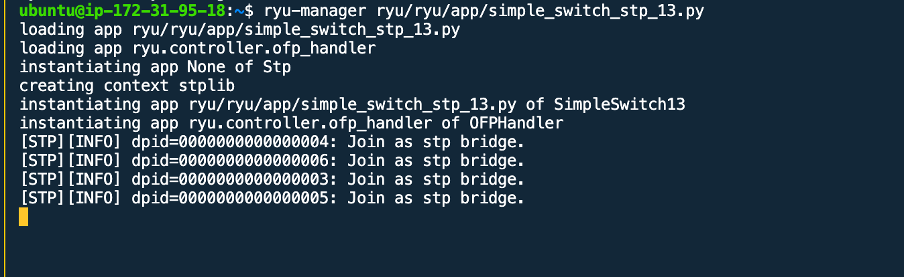

2. Jalankan mininet dengan controller=remote menggunakan custom topo yang sudah dibuat.

```
sudo mn --controller=remote --custom topoku_3sw6h.py --topo mytop
o --mac
```
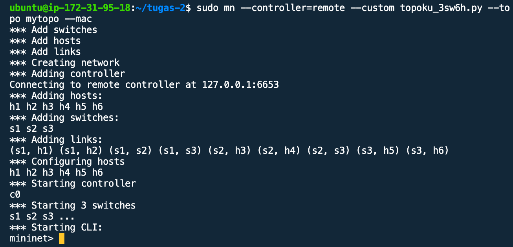

3. Pada ryu untuk menjadikan switch menjadi baik, proses identifikasi switch learning satu sama lain pada portnya yang terkoneksi. Hal pertama program akan BLOKING LISTENING untuk mengenali jaringan. Setelah itu ketika sudah mengetahui STP nya akan memblok salah satu yang tidak penting.

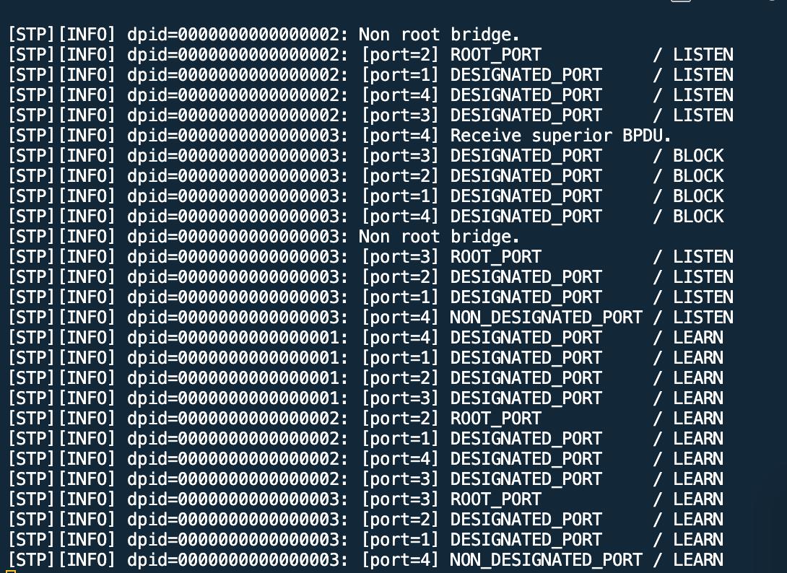

4. Dump untuk mengetahui jaringan

```
dpctl dump-flows -O openflow13
```
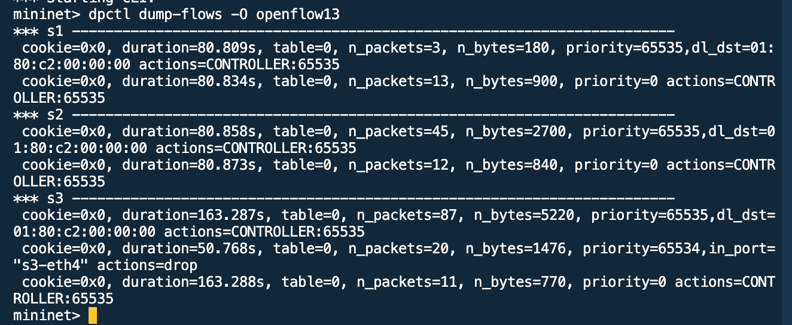

5. Terakhir mencoba untuk ping pada h5 to h3. Time di awal akan besar dan selanjutnya akan kecil karena sudah mengetahui jaringannya dan sudah ada di table flow nya.

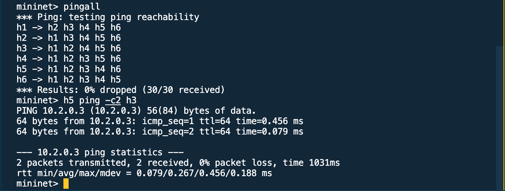

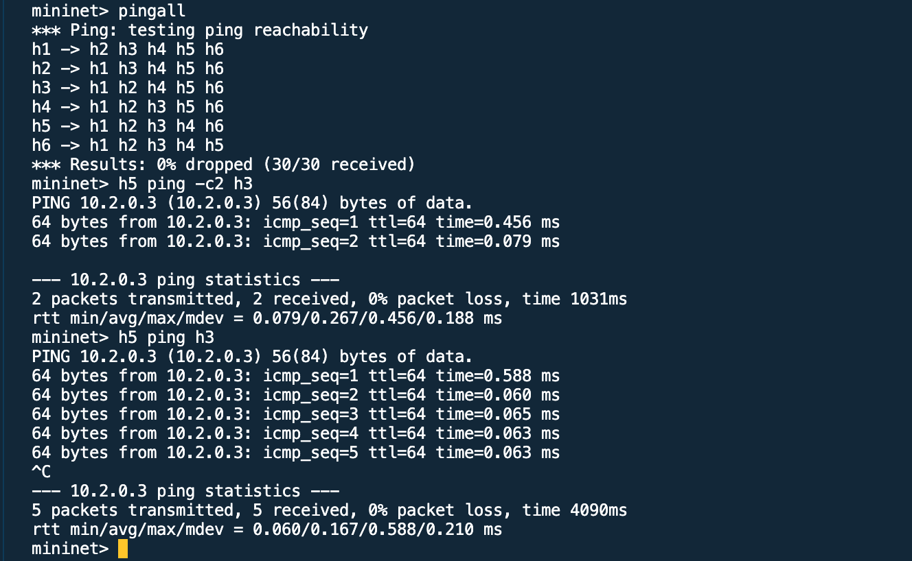

6. Pada ryu menunjukan paket-paket yang sedang berjalan

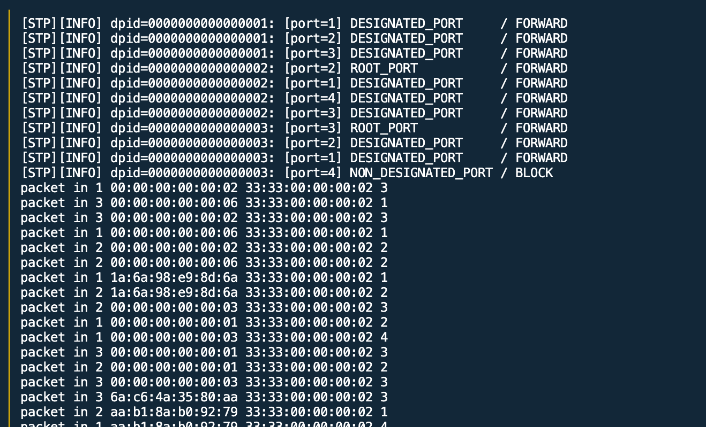

