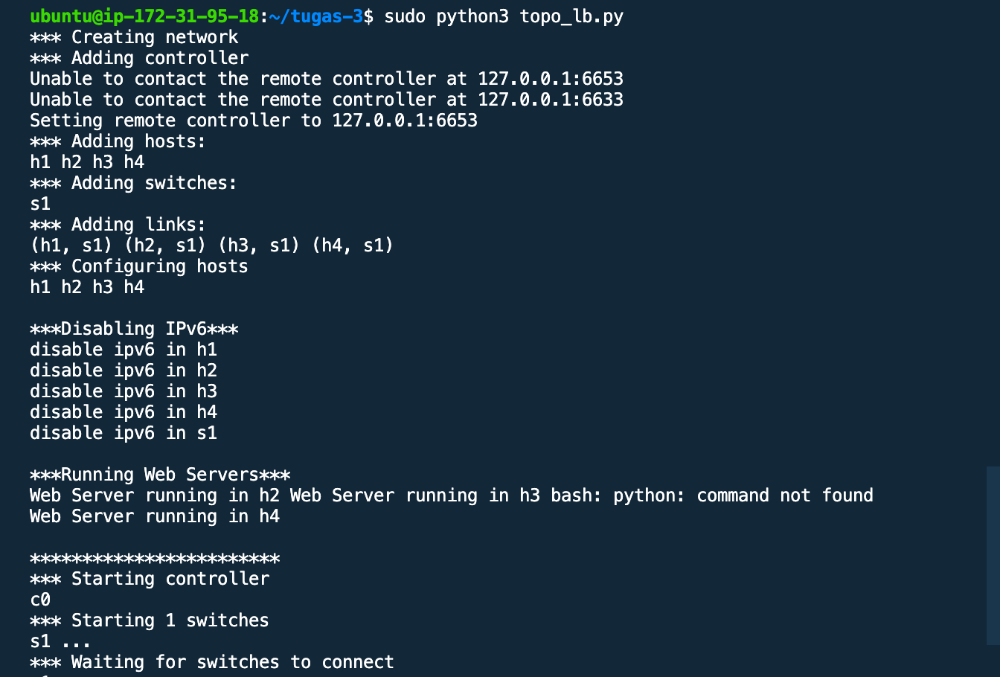
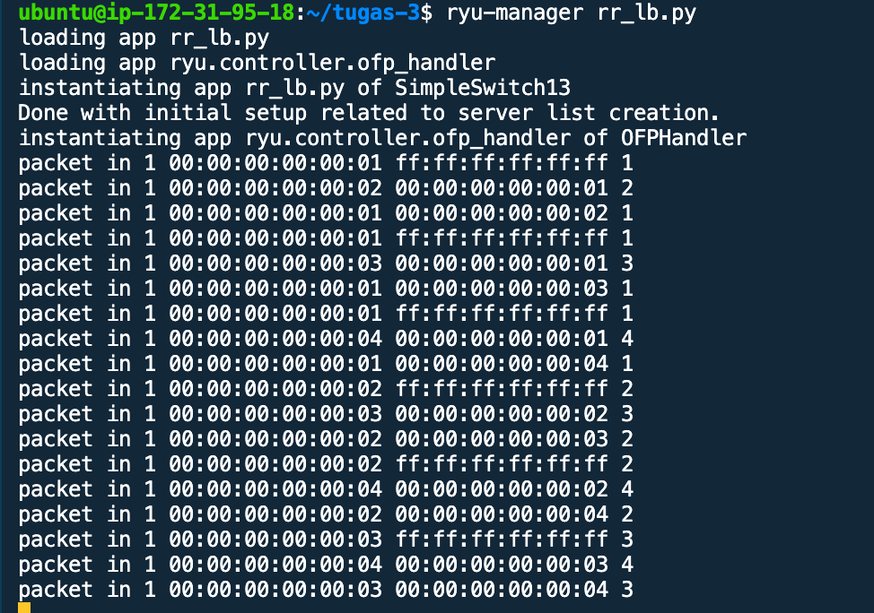
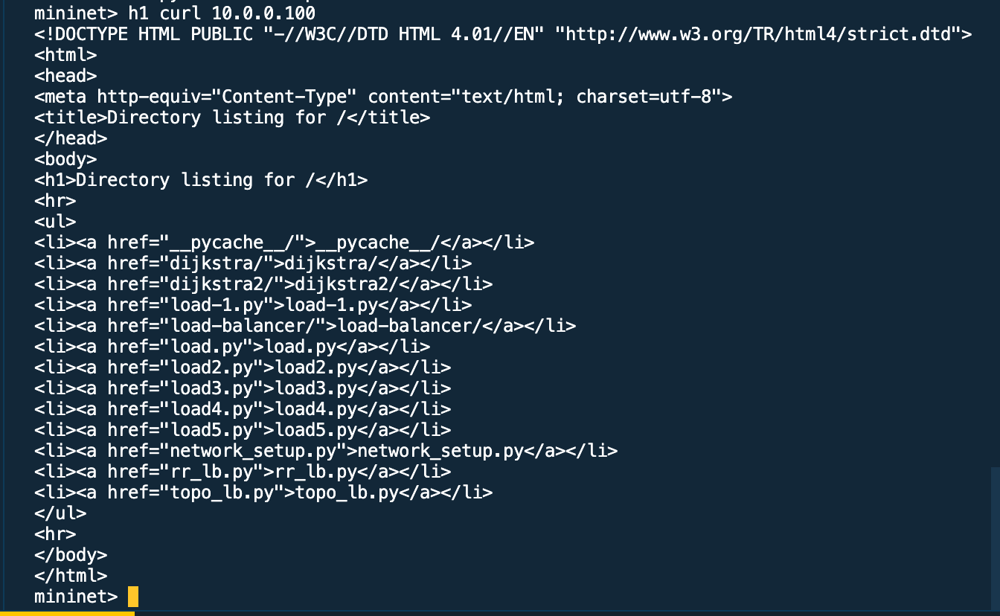
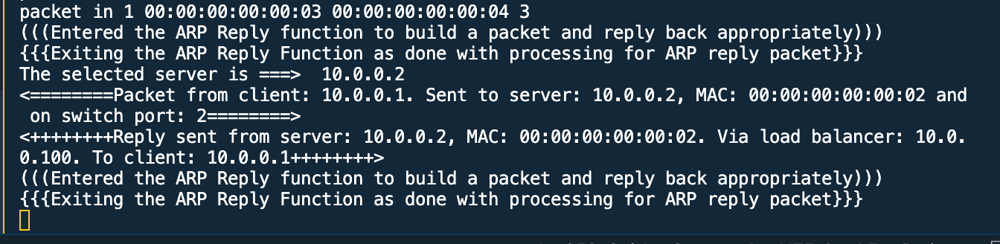
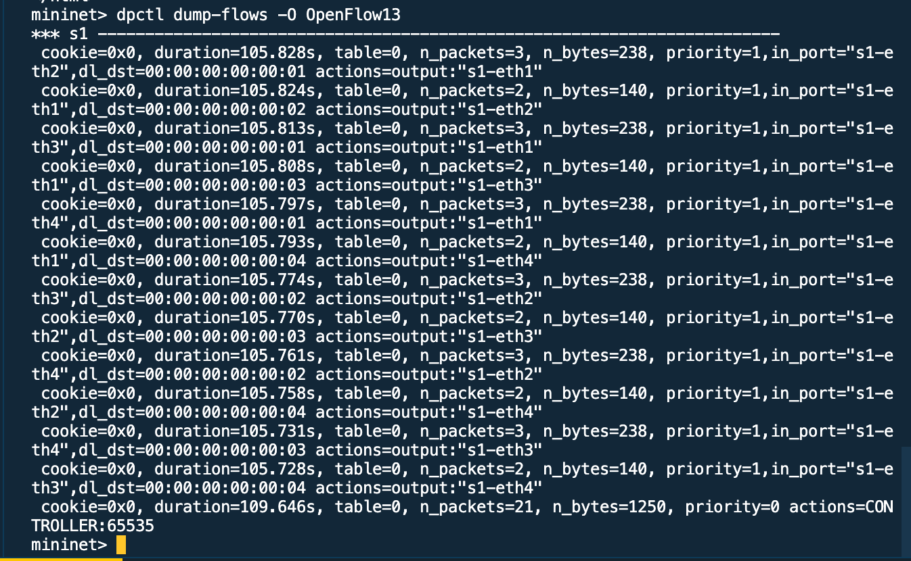
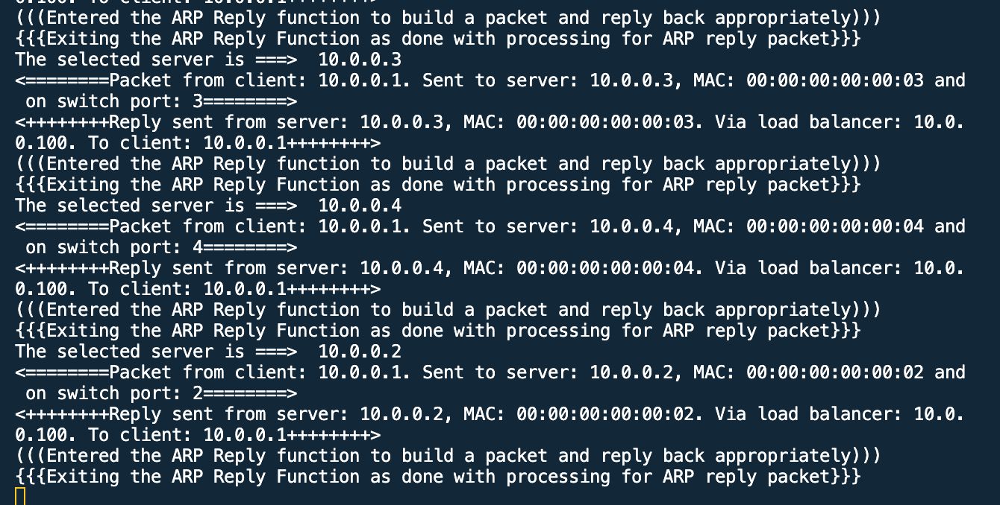

Tugas 3

Load Balancing

Pada program topo_lb.py akan membentuk topologi yang terdiri atas 4 hosts (h1 - h4) dan 1 switch (s1) dengan skenario sebagai berikut:

- h1 sebagai web client
- h2, h3, h4 sebagai web server

Pada program rr_lb.py secara umum akan mengeksekusi

- Virtual server pada IP 10.0.0.100
- Menentukan h2, h3, dan h4 sebagai server tujuan
- Menggunakan round-robin untuk meneruskan setiap tcp request baru ke server yang dipilih

1. Jalankan mininet dengan program dengan perintah pada salah satu terminal console:

```
sudo python3 topo_lb.py
```


2. alankan aplikasi rr_lb.py pada Ryu controller dengan ryu-manager pada terminal console lainnya:

```
ryu-manager rr_lb.py
```


3. Jalankan h1 mengakses virtual server
```
h1 curl 10.0.0.100
```


Load Balancing akan berjalan dari host 2



4. Dump untuk melihat jaringan



5. Lakukan sebanyak 4 kali untuk melihat proses load balancer pada masing - masing host server. Setelah itu cek status server pada h2 h3 h4. Ketika h1 mengakses virtual IP Ryu Controller akan membagi setiap kali akses menuju host h2 sampai h4 secara bergantian sesuai algoritma Round Robbin.




