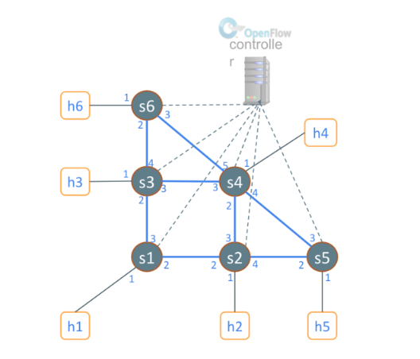
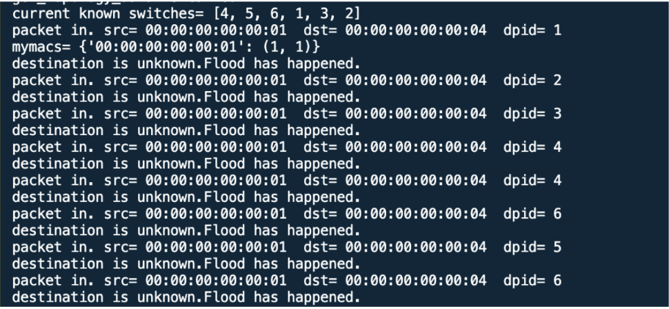

Tugas 4

SPF Routing

1. Monitoring RYU untuk mengetahui rute terpendek dengan menggunakan metode dijkstra. Topologi yang digunakan
sebagai berikut.



2. Jalankan program RYU. Perintah “—observe-links” digunakan untuk mengamati dan mengetahui posisi masing-masing switch terhubung satu sama lain termasuk untuk mendeteksi host-nya.

```
ryu-manager --observe-links dijksta_Ryu_controller.py
```


3. Jalankan program topologi


4. ping h1 ke h4


5. Cek monitoring RYU. Terjadi paket masuk dari host 1 (source) ke tujuan (destination) host 4. dpid merupakan switch yang digunakan. Paket akan mem-broadcast ke semua switch untuk mengetahui jalur mana yang dapat dilalui.



Proses akan mendapat hasil tujuannya berada dimana yaitu di switch 4 port 1 yang mana merupakan host 4. Setelah tujuan ditemukan, akan terjadi proses h1 untuk menentukan dengan iterasi sampai kemudian ditemukan jalur terpendek dari path yang sudah ditemukan.


6. Jalur yang ditemukan yaitu dari Swith 1 port 1 ke port 2 → Switch 2 port 2 ke port 3 → Switch 4 port 2 ke port 1.


